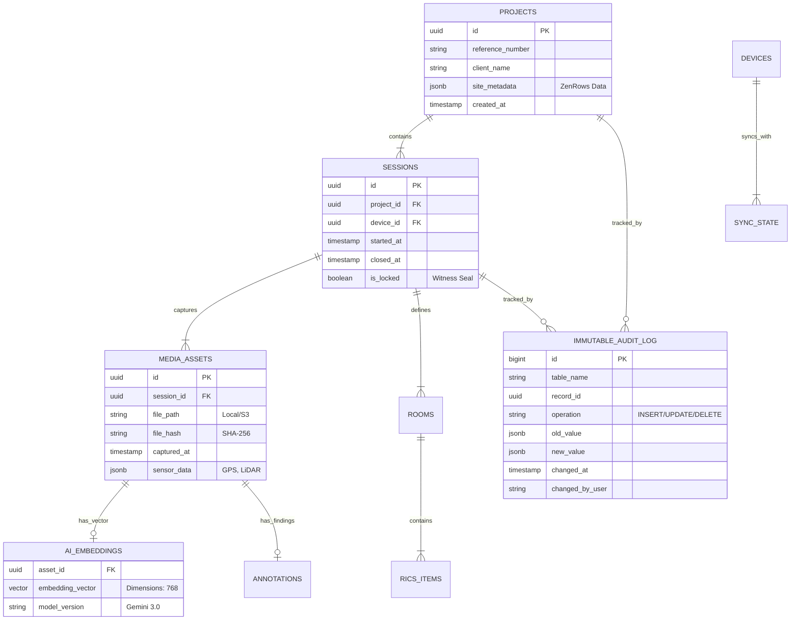

# 🗄️ مخطط قاعدة البيانات (Database Schema ERD)
**المحرك:** Google AlloyDB Omni (PostgreSQL Compatible)
**المميزات المفعلة:** `pgvector` (للمتجهات), `Columnar Engine` (للتحليل السريع).

---

## 🏗️ المخطط البياني (ERD)

---

## 🔍 تفاصيل الجداول التقنية

### 1. `immutable_audit_log` (الصندوق الأسود)
*   **الوظيفة:** جدول لا يكتب فيه التطبيق أبداً. يتم ملؤه فقط بواسطة **Triggers** داخل قاعدة البيانات.
*   **الهدف الجنائي:** إذا حاول أي مبرمج أو مخترق تغيير "تاريخ التقاط الصورة" في جدول `MEDIA_ASSETS`، سيقوم التريجر فوراً بتسجيل النسخة القديمة والجديدة ووقت التغيير هنا. هذا الجدول هو "الدليل القاطع" أمام المحكمة.

### 2. `ai_embeddings` (الذاكرة البصرية)
*   **الوظيفة:** تخزين ناتج تحليل Gemini للصورة كـ "مصفوفة أرقام" (Vector).
*   **الفائدة:** يسمح لنا بالبحث الدلالي. مثال: *"أعطني كل الصور التي تحتوي على عفن أسود في الزوايا"*، حتى لو لم نكتب ذلك في الوصف النصي. يتم استخدام إضافة `pgvector`.

### 3. `site_metadata` (الذكاء المسبق)
*   **نوع البيانات:** `JSONB`.
*   **الوظيفة:** تخزين البيانات القادمة من **ZenRows** (نوع التربة، خطر الفيضان، الصور التاريخية) بشكل مرن (NoSQL style) داخل جدول المشاريع، مما يسهل استدعاءها عند توليد التقرير.

### 4. `sync_queue` (المصافحة)
*   **الوظيفة:** جدول مؤقت لتنظيم وصول البيانات من الموبايل.
*   **الآلية:** لا يتم دمج البيانات في `MEDIA_ASSETS` إلا بعد التأكد من سلامة "الهاش" (Hash Integrity).

---

## 🔒 ملاحظة أمان
كلمة مرور المستخدمين **لا تخزن هنا**. نستخدم Google Identity Platform أو Firebase Auth، ونخزن فقط `user_uid` للربط.
