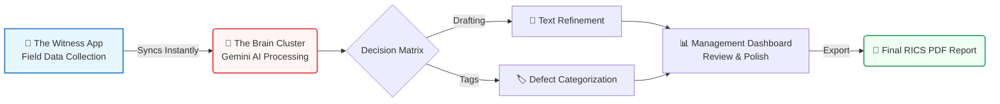
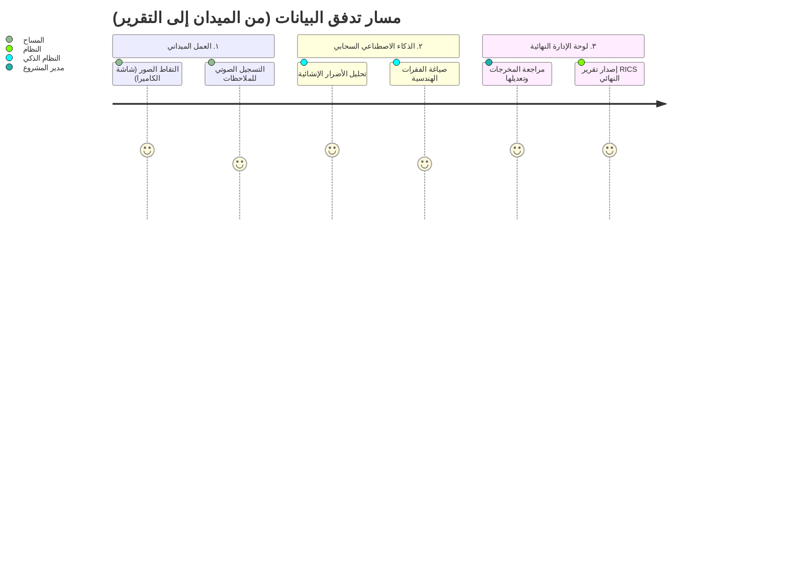

---
pdf_options:
  format: A4
  margin: 15mm
  printBackground: true
---

# RISC V2: Expert Surveyor Beta Testing Guide

  <em>Confidential Beta - Bilingual Document (English / Arabic)</em>

## 🌟 Welcome to the Future of Surveying

**Dear Expert Surveyors,**

You hold years of unparalleled field experience that no software can replicate. That is precisely why we built **RISC V2**. We did not build this system to change how you work; we built it to remove the friction from your work. You are invited to this exclusive Beta test to help us mold it. We need your sharp eyes, your deep RICS-standard knowledge, and your honest critique.

---

## 🏛️ System Architecture Workflow

Our system is composed of three main pillars working in perfect harmony in the Cloud.

<strong>Your Field Mission (Testing Phase):</strong> Try to break the app! Take photos of complex structures, record voice dictations speaking naturally about defects, and watch the AI instantly format your raw thoughts into professional architectural paragraphs.

---

## 🐛 Bug Reporting & Feedback Protocol

When you find a glitch or have a brilliant idea to save time on-site, report it to our WhatsApp group:

1. **Device:** (e.g., iPhone 15 Pro, Samsung S24)
2. **Location:** (e.g., Image Gallery screen)
3. **Issue/Idea:** (e.g., "App froze when taking 5 rapid pictures" OR "It would save me 2 hours if the camera auto-tagged dampness.")
4. **Visuals:** Always attach a **Screenshot**!

# نظام RISC V2: الدليل الإرشادي للخبراء (نسخة البيتا)

## 🌟 مرحباً بكم في مستقبل المسح الهندسي

**خبراءنا وزملاءنا المهندسون،**

أنتم تمتلكون سنوات من الخبرة الميدانية العميقة التي لا يمكن لأي آلة برمجية محاكاتها. ولهذا السبب تحديداً قمنا ببناء هذا النظام **RISC V2**. نحن لم نصمم هذا البرنامج لتغيير مبادئ عملكم الراسخة، بل برمجناه لإزالة العقبات الروتينية والورقية من طريقكم.

لقد دعوناكم لهذه النسخة التجريبية (Beta) ليس لمجرد "تجربة تطبيق تقني"، بل لتكونوا شركاءنا المهندسين في صياغته. نحن بحاجة إلى أعينكم الثاقبة، ومعرفتكم العميقة بمعايير RICS الهندسية، ونقدكم البنّاء لنجعل من هذا النظام السلاح الأقوى في مجال الفحص.

---

## 🏛️ مخطط واجهات العمل (User Experience Flow)

كيف تتحرك بياناتكم من أرض الموقع إلى التقرير المطبوع؟

<strong>ما المطلوب منكم؟ (مهمة التجربة):</strong> نريد منكم استخدام النظام وكأنكم في فحص موقع حقيقي.. لا تترددوا في اختباره بقسوة وأثناء حركة سريعة! انتقلوا بين الغرف، العبوا بالصور، وتحدثوا بشكل طبيعي للبرنامج عن المشاكل (مثلاً: "وجود رطوبة صعودية شديدة أسفل الجدار"). ولاحظوا كيف سيحوّلها النظام لفقرات هندسية معتمدة.

---

## 🐛 كيفية التبليغ وتقييم البرنامج (مجموعة الواتساب)

المشاكل البرمجية سهلة الإصلاح، ولكن توجيهكم المهني هو الأهم. في حال واجهتكم مشكلة أو خطرت لكم فكرة، نرجو الإرسال للجروب بالصيغة التالية:

1. **نوع الهاتف:** (آيفون أو أندرويد)
2. **مكان المشكلة:** (مثال: شاشة رفع الصور)
3. **الفكرة/المشكلة:** (مثال: الشاشة علقت فجأة - أو - لدي فكرة لوضع تصنيف تلقائي للرطوبة سيوفر علينا ساعتين من العمل).
4. **صورة للشاشة:** لقطة شاشة (Screenshot) تخبرنا بألف كلمة!

